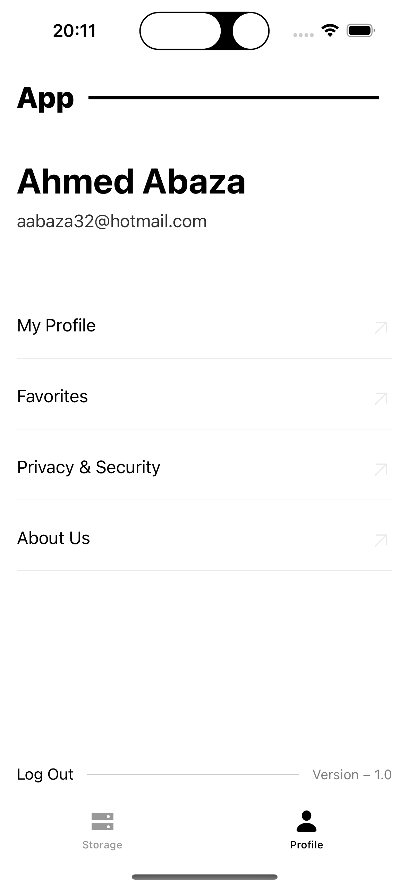

# A brief app intro

A Nativ iOS application for a media sharing platform allows users to upload images or videos, view a list of
all images and videos, and like/unlike them. The app consumes a RESTful API to perform these operations.

## Features

-   Authentication
-   Upload images or videos
-   View a list of all images and videos
-   Like/unlike images and videos

## Technologies

-   Swift
-   SwiftUI
-   URLSession
-   MVVM

## Installation

1. Clone the repository
2. Open the project in Android Studio
3. Run the project on an emulator or physical device
4. Enjoy the app!

## API

The app consumes a RESTful API to perform operations. The API documentation can be found [here](https://github.com/aabaza97/MSWE-Assignment)

## Screenshots

| Screenshot 1                          | Screenshot 2                          | Screenshot 3                         |
| ------------------------------------- | ------------------------------------- | ------------------------------------ |
|   |    |  |
| Screenshot 4                          | Screenshot 5                          | Screenshot 6                         |
|  |     |  |
| Screenshot 7                          | Screenshot 8                          |                                      |
|    |  |

## Considerations

-   The app is still in development and may contain bugs, the main focus was to get the basic functionality working.
-   The app is not optimized for tablets or larger screens.
-   Not all best practices were followed, as the main focus was to get the basic functionality working(AGIAIN).
-   The app is not localized, and only supports English.
-   The app does not support dark mode.
-   The app does not support offline mode.
-   The app does not support push notifications.
-   The app does not support caching.
